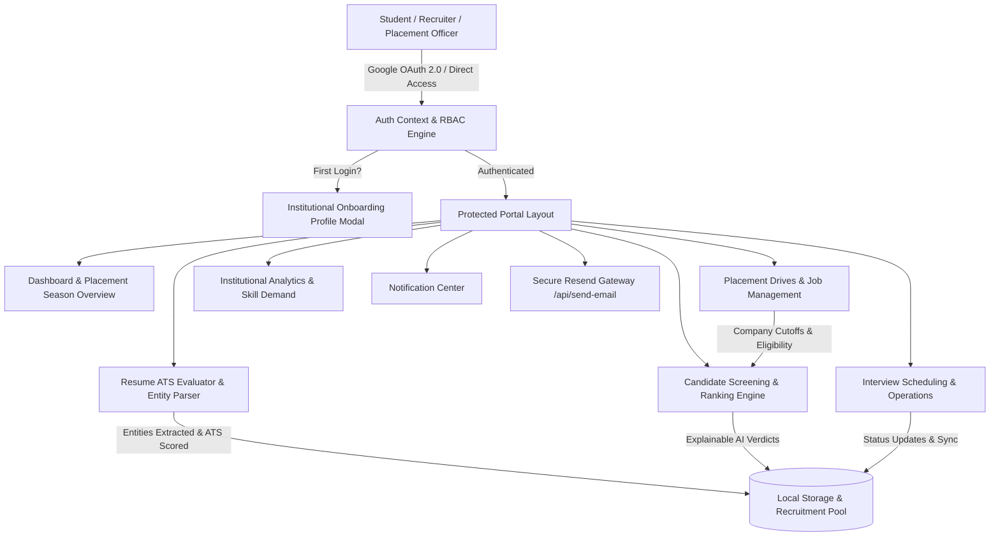

# SRM Resume AI — System Architecture & Design Specification

## Overview
**SRM Resume AI** is an institutional placement intelligence platform designed for the **Directorate of Career Centre, SRM Institute of Science and Technology (SRMIST)**. The system streamlines campus hiring drives, evaluates student resumes with explainable ATS scoring, enforces Role-Based Access Control (RBAC), and manages candidate pipelines with zero synthetic dummy data.

---

## Architecture Diagram

---

## Core Modules & Engine Specifications

### 1. ATS Scoring & Weighted Evaluation Algorithm
The candidate evaluation is computed across 5 weighted dimensions:

$$\text{Overall ATS Match} = \sum (W_i \times S_i)$$

| Dimension | Default Weight | Evaluated Signals |
| :--- | :--- | :--- |
| **Skills Coverage** | 40% | Mandatory & preferred keyword presence, semantic synonyms, technical depth |
| **Experience & Internships** | 25% | Duration, relevant technical roles, leadership impact |
| **Academic Eligibility** | 20% | Degree, branch match, CGPA vs. cutoff, backlog threshold |
| **Projects & Innovation** | 10% | Tech stack breadth, project complexity, GitHub presence |
| **Certifications** | 5% | Industry-recognized institutional credentials |

### 2. Explainable AI Match Tiers
- **Strong Match ($\ge 80\%$)**: Direct recommendation for technical screening & interview scheduling.
- **Needs Review ($60\% - 79\%$)**: Highlights missing preferred keywords and potential growth areas.
- **Low Match ($< 60\%$)**: Pinpoints missing core requirements and unfulfilled criteria.
- **Ineligible**: Triggered automatically when academic cutoffs (CGPA, active backlogs, department) fail.

### 3. Role-Based Access Control (RBAC) Matrix

| Action / Permission | Super Admin | Placement Officer | Faculty Coordinator | Corporate Recruiter | Student Coordinator |
| :--- | :---: | :---: | :---: | :---: | :---: |
| **Post Placement Drives** | ✅ | ✅ | ❌ | ❌ | ❌ |
| **Screen & Filter Candidates** | ✅ | ✅ | ✅ | ✅ | ✅ (View) |
| **Shortlist Candidates** | ✅ | ✅ | ❌ | ✅ | ❌ |
| **Schedule Interviews** | ✅ | ✅ | ❌ | ✅ | ❌ |
| **Update System Settings** | ✅ | ❌ | ❌ | ❌ | ❌ |
| **Export Official Reports** | ✅ | ✅ | ✅ | ✅ | ❌ |

---

## Security & Privacy Compliance
1. **Zero Mock Data Default**: System initializes in a completely clean institutional state, ensuring live recruitment data is real and isolated.
2. **First-Time Profile Verification**: Automatically prompts institutional credentials (Register Number, Campus, Department, Designation) on first sign-in.
3. **Server Rate Limiting**: Gateway protection on `/api/send-email` (25 requests/min per IP with 200KB payload limit).
4. **Formula Injection Sanitization**: All CSV/Excel exports sanitize formula prefixes (`=`, `+`, `-`, `@`) to prevent CSV injection vulnerabilities.
