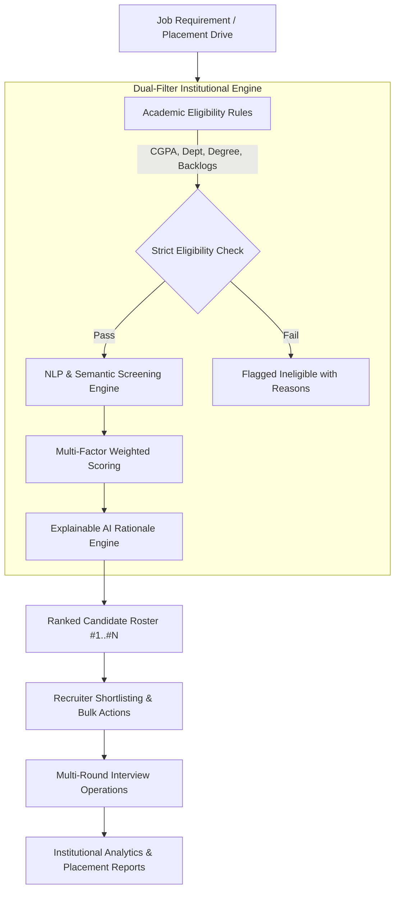

# 🎓 SRM ResumeAI

### AI-Powered Resume Screening, Candidate Ranking and Recruitment Management Platform for Institutional Placement

[](https://reactjs.org/)
[](https://www.typescriptlang.org/)
[](https://vitejs.dev/)
[](https://tailwindcss.com/)

---

## 📌 Project Overview

**SRM ResumeAI** is an AI-assisted institutional placement and recruitment screening management system designed for **SRM Institute of Science and Technology (SRMIST)**.

When hundreds or thousands of students apply for university placement drives (e.g., 1,200+ applicants), recruiters face severe bottlenecks manually opening every resume and validating eligibility. **SRM ResumeAI** automates the initial screening pipeline using a dual-filter architecture:

1. **Strict SRM Academic Eligibility Filter**: Pre-screens candidates on degree, branch, minimum CGPA cutoff, active backlogs limit, and graduation passing batch.
2. **Explainable AI Semantic Scoring Engine**: Weighted multi-dimensional NLP score evaluating Core Technical Skills (40%), Experience & Internships (25%), Academic Standing (20%), Applied Projects (10%), and Verified Certifications (5%).
3. **Candidate Ranking & Shortlisting Operations**: Automatically ranks candidates from #1 to #N with explainable "Why did this candidate receive X%?" rationale, missing skill warnings, and evidence audit trails.
4. **Human-in-the-Loop Safeguard**: AI recommends and scores; final shortlisting and interview invites remain strictly with human placement officers.

---

## 🚀 Key Modules & Architecture



### ✨ Features
- **Placement Command Center Dashboard**: Real-time KPI metrics, dynamic SVG resume processing trends, conversion funnels, and active corporate recruitment drive tables.
- **Job Requirement Creator**: Specify SRM degree/department eligibility, minimum CGPA, active backlog ceilings, and required (⭐) vs preferred skill taxonomies.
- **Drag & Drop Resume Upload Pipeline**: Client-side parsing for `.pdf`, `.docx`, and `.txt` files with animated processing pipelines and a 1-click batch simulation loader.
- **AI Screening Hub & Ranking**: Ranked cards and tabular views with match score rings, department filters, and eligibility tags.
- **Explainable AI Drawer ("Why Score%?")**: Positive factor breakdown, penalty/gap analysis, and a complete Skill Evidence Matrix.
- **Shortlist & Interview Management**: Status progression tracking across Technical Round 1, Technical Round 2, HR, and Final Offer releases.
- **Institutional Analytics & Reports**: Department conversion analysis, skill demand vs student competency heatmaps, and printable placement reports.
- **Customizable AI Weights**: Recruiter-configurable formula weights and threshold sliders.

---

## 🛠️ Technology Stack

- **Frontend**: React 18, TypeScript, Tailwind CSS, Lucide Icons, Canvas Confetti
- **Build Tool**: Vite 6
- **Architecture**: Modular Component-Based Architecture, Client-side NLP & Entity Extraction Engine, Reactive State Management

---

## 💻 Getting Started Locally

### Prerequisites
- Node.js (v18+ recommended)
- npm or yarn

### Installation
```bash
# 1. Clone repository
git clone <YOUR_REPO_URL>
cd "Ai resume inhouse srm"

# 2. Install dependencies
npm install

# 3. Start local development server
npm run dev
```

Open [http://localhost:3000](http://localhost:3000) in your browser.

---

## 📜 License
Developed for SRM Institute of Science and Technology Directorate of Career Centre. 
